# Forehand stroke posture analysis ＆ 3D visualization for table tennis beginners

It's my undergraduate project aims to help beginners learn table tennis by providing them 3D skeleton motion & improvement suggestions.
With one camera, like a cellphone, users can visualize their 3D skeleton with motion in 3D space, and compare it with the one from an expert we provided. Moreover, considering that beginners need some concrete advice, we train an LSTM to classify user's motion and the software gives suggestions according to the result.

    

## Features

- 3D Visualization

    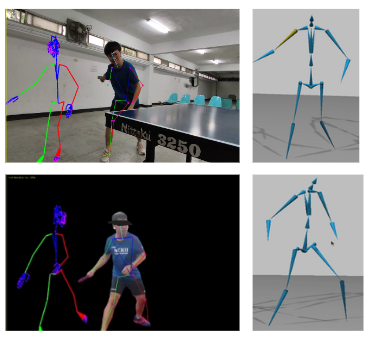

  - **Side-by-Side Comparison**: Display the expert’s and the beginner’s motions simultaneously, allowing users to compare their postures.

- LSTM Posture Analysis

  - LSTM classifies the motion and the software gives suggestions by the result.

    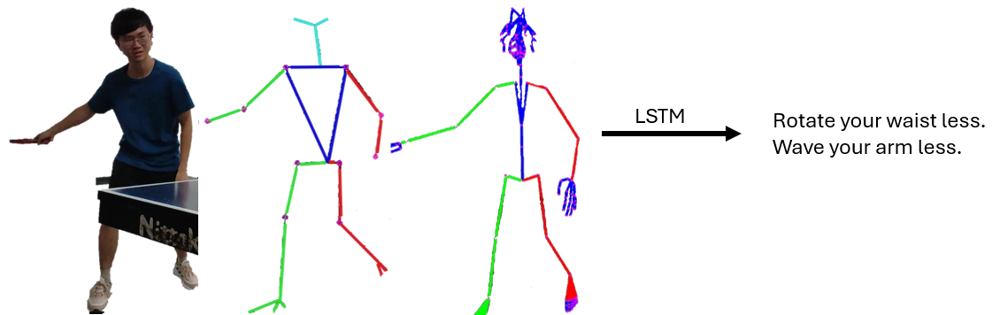

## Demo

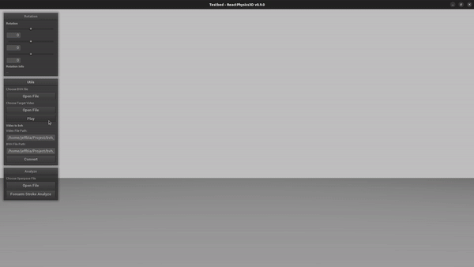
  

[Full Demo video link](<[./static/pictures/finaldemo-bigandsmall-wrong.mp4](https://youtu.be/aiRTnW4jOg0?si=T2hMTYKZND0eIQ9l)>)

### Interface

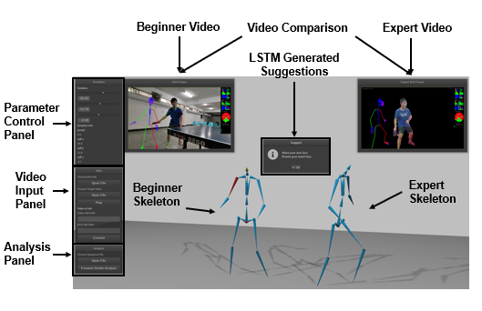

## Motivation

- **Complexity of Techniques**: Table tennis involves intricate techniques that beginners find difficult without proper guidance.
- **High Cost and Time Investment**: It takes much time and money if beginners want to get feedback and correct their posture.
- **Lack of effective Apps**: Few Apps teach beginners how to exercise right.

## LSTM DataSet & Result

### Dataset

#### Training dataset

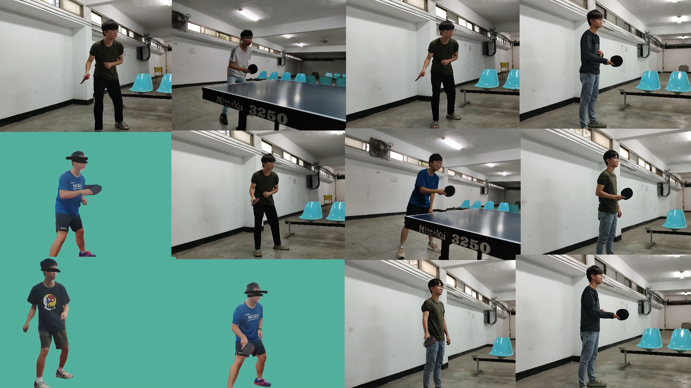

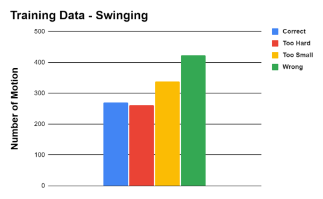 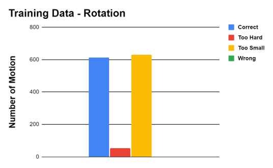

#### Testing dataset

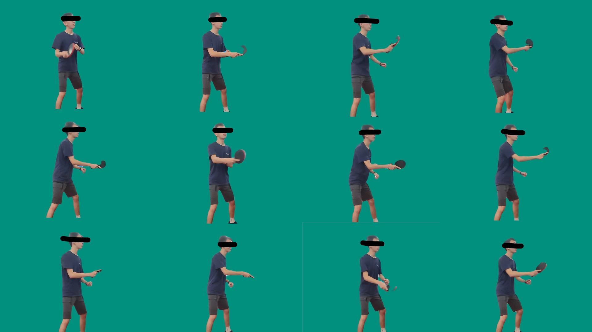

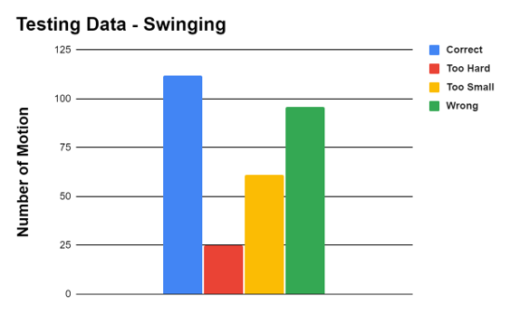 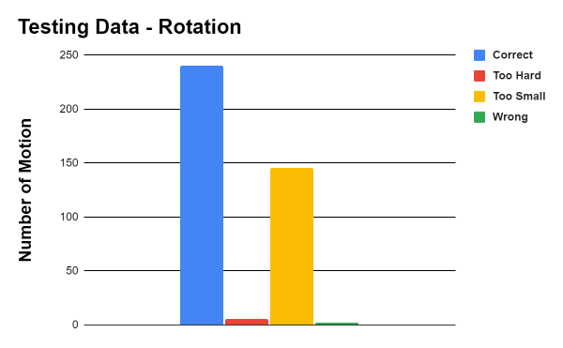

### Result

## Dependencies

- [OpenPose](https://github.com/CMU-Perceptual-Computing-Lab/openpose.git)
- [MocapNet](https://github.com/FORTH-ModelBasedTracker/MocapNET.git)
- [LSTM posture suggestion (LSTM model)](https://github.com/JeffBla/lstm-posture-suggestion.git)
- [BVH rotation analysis (video preprocess & analysis)](https://github.com/JeffBla/bvh_rotation_analysis.git)
- [Pybind11](https://github.com/pybind/pybind11.git)
- [Pytorch](https://pytorch.org/)
- [Pytorch lightning](https://lightning.ai/docs/pytorch/stable/)
- [NanoGUI](https://github.com/wjakob/nanogui.git)
- [PyAutoGui - Mouse Recorder](https://github.com/JeffBla/PyAutoGUI-Recorder.git) -> for Demo purpose.

### OpenGL

- [OpenGL](https://www.opengl.org/)
- [GLFW](https://www.glfw.org/)
- [GLM](https://github.com/g-truc/glm.git)
- [ReactPhysics3D](https://www.reactphysics3d.com/)

## Future work

- [ ] Bvh motion retarget. Attach bvh motion to model for more comprehensive visualization.\
       We'd already worked on the feature. Here is the example.

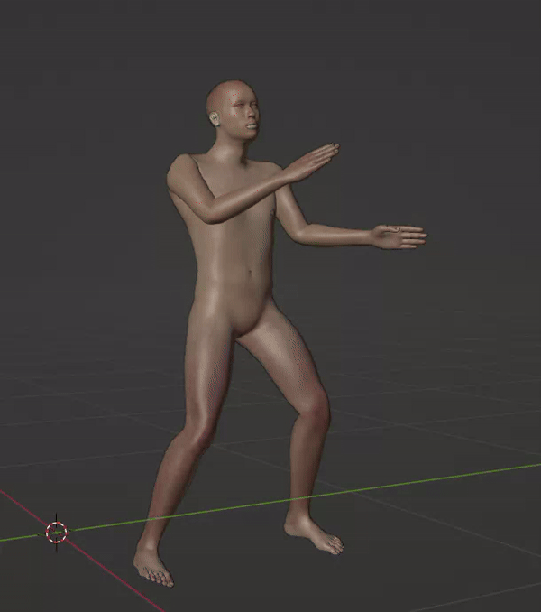

## References

- Qammaz, A., & Argyros, A.A. (2019). MocapNET: Ensemble of SNN Encoders for 3D Human Pose Estimation in RGB Images. British Machine Vision Conference
- A. Qammaz and A. Argyros, "Occlusion-tolerant and personalized 3D human pose estimation in RGB images," 2020 25th International Conference on Pattern Recognition (ICPR), Milan, Italy, 2021, pp. 6904-6911, doi: 10.1109/ICPR48806.2021.9411956.
- [LSTM](https://pytorch.org/docs/stable/generated/torch.nn.LSTM.html)

## License

[MIT](https://choosealicense.com/licenses/mit/)
